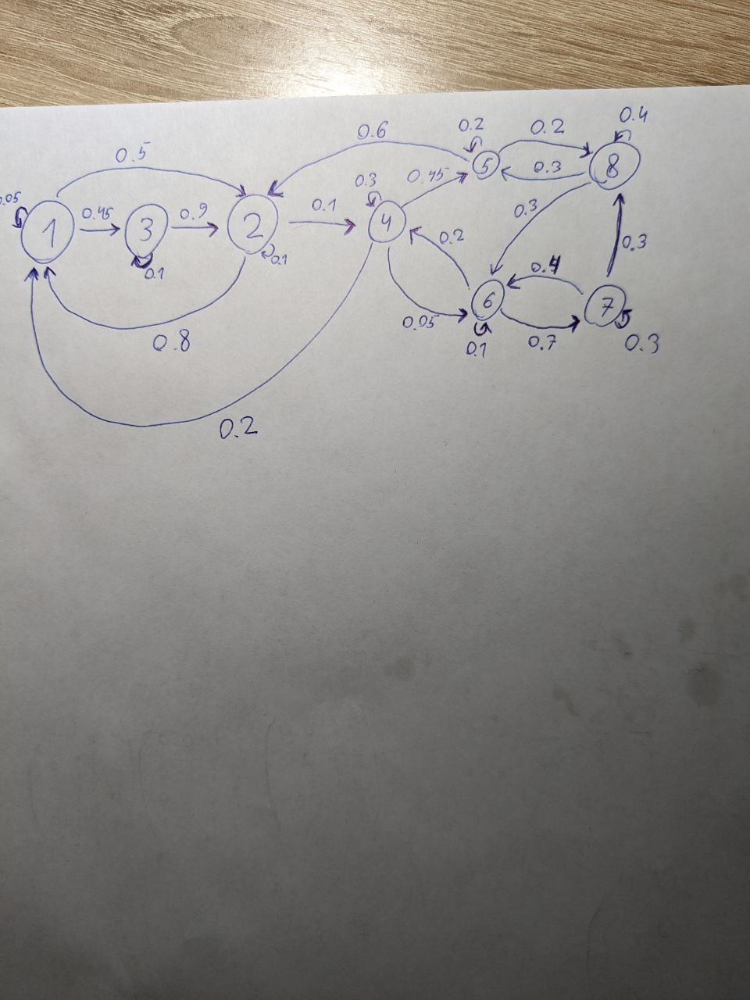

# AppliedMath

## Участники

* Ли Евгений
* Олег Куликов
* Михаил Валуйский

[Таблица с баллами](https://docs.google.com/spreadsheets/d/1UH2SNmbw_yKZ3siwWGi0jxeeCyOucu4jW-RItr7jtZI/edit#gid=2096628959)

[Таблица на запись](https://docs.google.com/spreadsheets/d/1N9RXrqju4psebUC-iCpuIlA6RZFiLGeTjuMm0VjktpE/edit#gid=1296426686)
 

# Условия лаб:

* [Лаба 1](./media/lab_1_optimization.pdf)
* [Лаба 2](./media/lab_2.pdf)
* [Лаба 3](./media/lab_3.pdf) 
Придуманная цепь:

